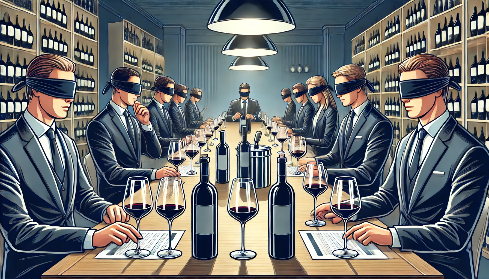

# 🍷 Wine Score Predictor


**¿Qué puntuación recibiría un vino en una cata a ciegas?** Descúbrelo con esta aplicación interactiva desarrollada en Streamlit. Este proyecto utiliza machine learning para predecir la valoración aproximada que podría obtener un vino basándose en sus características principales.

---

## 📝 Descripción del Proyecto

Este proyecto es una herramienta creada para los amantes del vino y entusiastas de la enología. La aplicación permite predecir la calidad de un vino utilizando un modelo de machine learning previamente entrenado. Basándose en datos como el país de origen, estilo, variedad de uva, denominación de origen, clasificación, año de cosecha y precio, se genera una predicción que clasifica al vino en una escala de calidad.

### Escala de Calidad
La predicción clasifica el vino en uno de los siguientes rangos:

- **Clásico** (98-100): El pináculo de la calidad.
- **Excepcional** (94-97): Un gran logro enológico.
- **Excelente** (90-93): Altamente recomendado.
- **Muy bueno** (87-89): Buena relación calidad-precio.
- **Bueno** (83-86): Perfecto para el consumo diario.
- **Aceptable** (80-82): Modesto, pero funcional.
- **Sin calificar**: Por debajo de 80 puntos.

---

## 🚀 Cómo Ejecutar el Proyecto

### Requisitos
1. Python 3.8 o superior.
2. Librerías necesarias:
    ```
    streamlit
    pandas
    numpy
    scikit-learn
    ```


## 📊 Modelo de Machine Learning

El modelo fue entrenado con un conjunto de datos detallado sobre vinos, usando un enfoque supervisado. Se seleccionaron características clave como variables predictoras y se utilizó un pipeline que incluye preprocesamiento y categorización.

### Variables Predictoras:
- Año de cosecha
- Bodega
- Estilo de vino
- Variedad de uva
- Denominación de origen
- Clasificación (Crianza, Reserva, etc.)
- Precio estimado

---

## 💻 Contribución

Si deseas contribuir al proyecto, ¡eres más que bienvenido! Puedes reportar problemas, proponer mejoras o realizar un pull request.

---
